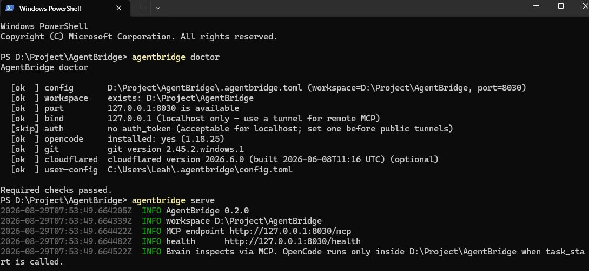
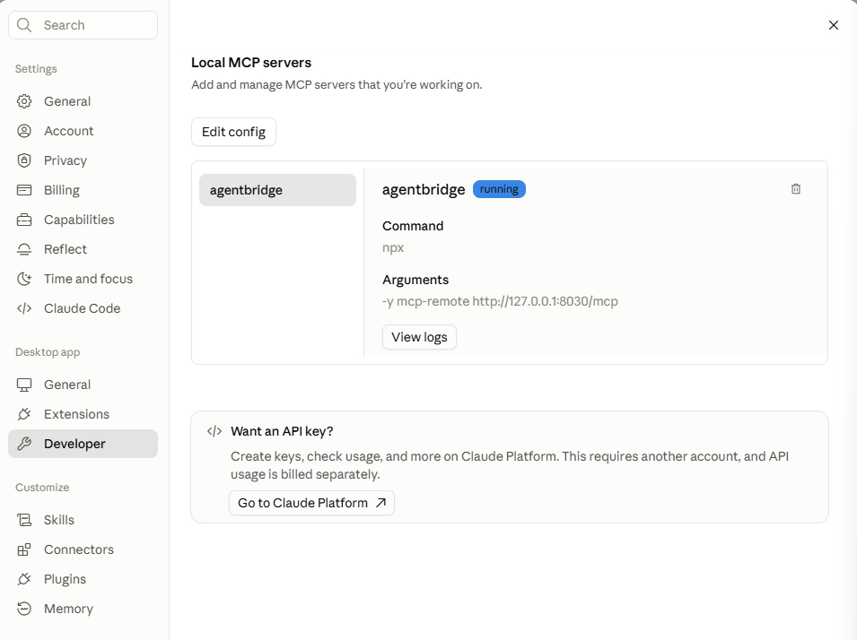

# AgentBridge

**让一个 AI 思考，让另一个 AI 写代码。**

AgentBridge 通过 **MCP** 将 Web 端 AI 的推理能力与本地 Coding Agent 连接起来。

你可以让一个更适合**思考、分析和规划**的 AI 负责理解项目，让你已经在使用的 Coding Agent 负责**修改代码、执行命令和运行测试**。

> **让最擅长思考的 AI 思考，让最适合执行的 Coding Agent 执行。**

[🇺🇸 English](README.md) · [📦 crates.io](https://crates.io/crates/agentbridge) · [🐙 GitHub](https://github.com/IndexFlowing/AgentBridge)

[](https://crates.io/crates/agentbridge)
[](LICENSE)
[](https://www.rust-lang.org/)

---

# 为什么需要 AgentBridge？

现在的 AI Coding 工具通常把两件完全不同的事情放在了一起：

* **Reasoning（思考）**：理解代码库、探索项目、分析问题、理解架构、设计解决方案、制定计划以及 Review 修改结果。
* **Execution（执行）**：修改文件、执行命令、运行测试，以及真正完成代码实现。

但实际上，**思考和执行并不一定需要由同一个 AI 完成。**

你可能拥有：

* 一个 Web AI，使用额度比较充足，而且非常擅长复杂推理；
* 一个 Coding CLI，可以直接操作本地代码，但订阅额度更加有限。

传统的 Coding Agent 工作流是：

```text
理解 → 探索 → 思考 → 规划 → 编码 → 测试 → Review
```

所有这些步骤都消耗同一个 Coding Agent 的额度。

AgentBridge 把它们拆开：

```text
                 🧠 BRAIN
              Web-based AI
          Gemini / Claude / ...
                 │
            思考 / 分析 / 规划
                 │
                MCP
                 ▼
        ┌─────────────────┐
        │   AgentBridge   │
        └────────┬────────┘
                 │
             C2C PLAN
                 │
                 ▼
             🛠️ EXECUTOR
            Local Coding Agent
                OpenCode
                 │
           修改 / 执行 / 测试
                 │
                 ▼
          Local Workspace
```

核心思想非常简单：

> **让最擅长思考的 AI 思考，让最适合执行的 Coding Agent 执行。**

---

# AgentBridge 的核心价值

AgentBridge 并不是为了再做一个 AI Coding Agent。

它解决的是另一个问题：

> **AI Coding 的“思考”和“执行”其实可以被拆成两个独立的资源。**

例如：

```text
Gemini Web
    │
    │ 理解项目 / 分析问题 / 制定方案
    ▼
AgentBridge
    │
    │ 紧凑的 C2C PLAN
    ▼
OpenCode CLI
    │
    │ 修改代码 / 运行测试
    ▼
你的项目
```

这样，你可以把更有限的 Coding Agent 额度主要留给真正需要本地执行的工作。

---

# 这不是“绕过额度”

AgentBridge 不提供任何模型额度，也不绕过任何 AI 服务商的限制。

它：

* 不提供额外的模型 Credits；
* 不绕过订阅限制；
* 不绕过 Provider 的 Rate Limit；
* 不非法访问付费模型；
* 不代理模型 API；
* 不把你的代码上传到 AgentBridge 的服务器。

它做的事情只是：

> **把你已经拥有的不同 AI 工具组合起来，让它们各自承担最合适的工作。**

AgentBridge 更像是一个 **AI Coding Workflow Bridge**，而不是另一个 AI Coding 产品。

---

# 🧠 Brain

Brain 是负责**思考**的 AI。

它可以：

* 查看项目结构；
* 搜索代码；
* 阅读文件；
* 理解架构；
* 分析 Bug；
* 制定实现方案；
* 创建任务计划；
* 查看 Git Diff；
* 查看测试结果；
* Review Executor 的修改。

Brain 通过 AgentBridge 提供的 MCP 工具访问本地项目。

**Brain 本身不会直接修改文件。**

---

# 🛠️ Executor

Executor 是负责**执行**的 Coding Agent。

它可以：

* 修改文件；
* 创建文件；
* 执行命令；
* 运行测试；
* 根据 PLAN 完成实现；
* 返回执行结果。

当前 AgentBridge 使用 **OpenCode** 作为 Executor。

未来可以支持更多 Coding Agent。

---

# 🌉 AgentBridge

AgentBridge 就是连接 Brain 和 Executor 的桥梁。

它负责：

* MCP Server；
* Workspace Inspection；
* Task Delegation；
* C2C Protocol；
* Task Lifecycle；
* Git Status；
* Git Diff；
* Test Status；
* Execution Result。

整个系统形成：

```text
        Brain
          │
       Reason
          │
        PLAN
          │
          ▼
    AgentBridge
          │
       Execute
          │
          ▼
       Executor
          │
      Code / Test
          │
          ▼
      Workspace
```

---

# 工作流程

一个完整的任务通常是：

```text
用户提出需求
      │
      ▼
    Brain
      │
      ├── 查看项目
      ├── 理解架构
      ├── 分析问题
      └── 制定 PLAN
              │
              ▼
        AgentBridge
              │
           C2C PLAN
              │
              ▼
          Executor
              │
        ┌─────┼─────┐
        │     │     │
       修改   命令   测试
        │     │     │
        └─────┼─────┘
              │
              ▼
          Git Diff
              │
              ▼
            Brain
              │
            Review
              │
         ┌────┴────┐
         │         │
        DONE    PLAN AGAIN
```

最终形成一个闭环：

```text
PLAN → EXECUTE → REVIEW → DONE
             ↑            │
             └── PLAN ────┘
```

---

# MCP：让 Brain 看见你的项目

AgentBridge 使用 **Model Context Protocol (MCP)** 向 Brain 提供本地 Workspace 的只读访问能力。

主要工具包括：

| Tool                | 作用                      |
| ------------------- | ----------------------- |
| `workspace_info`    | 查看 Workspace 信息和 Git 状态 |
| `list_directory`    | 查看项目结构                  |
| `read_file`         | 阅读文件                    |
| `search_workspace`  | 搜索代码                    |
| `git_status`        | 查看 Git 状态               |
| `git_diff`          | 查看修改                    |
| `test_status`       | 查看最近的测试结果               |
| `execution_summary` | 查看 Executor 执行结果        |

Brain 不会获得一个完整的 Shell。

它也不能直接修改文件。

这是 AgentBridge 有意设计的权限边界。

---

# C2C：Brain 和 Executor 之间的协议

AgentBridge 使用一个简单的结构化协议：

**C2C — Context-to-Context**

Brain 不需要把整个代码库复制给 Executor。

它只需要生成一个紧凑的实现计划：

```text
[C2C]
STATE: PLAN
TASK_ID: c2c_12345
ITERATION: 1

GOAL:
Add URL inspection support to the GSC client.

ACTIONS:
1. Inspect the existing GSC client.
2. Add URL inspection support.
3. Add tests for indexed and non-indexed URLs.

TESTS:
cargo test

SUCCESS_CRITERIA:
Tests pass and the API correctly reports indexed / non-indexed.
```

真正的代码仍然留在本地 Workspace。

跨越 Brain → Executor 边界的主要是：

```text
任务目标
+
实现步骤
+
测试要求
+
成功标准
```

而不是整个项目上下文。

---

# Read-Only Brain / Write-Capable Executor

AgentBridge 最重要的设计之一，就是明确区分 Brain 和 Executor 的权限。

Brain 可以：

```text
✓ 查看代码
✓ 搜索代码
✓ 查看项目结构
✓ 查看 Git 状态
✓ 查看 Git Diff
✓ 查看测试结果
✓ 制定 PLAN
```

Brain 不可以：

```text
✗ 修改文件
✗ 删除文件
✗ 执行 Shell
✗ Commit
✗ Push
```

这些操作由 Executor 完成。

```text
                 Read-only
                    │
                    ▼
              ┌───────────┐
              │   Brain   │
              └─────┬─────┘
                    │
                  PLAN
                    │
                    ▼
              ┌───────────┐
              │ Executor  │
              └─────┬─────┘
                    │
             Write / Execute
                    │
                    ▼
              Local Project
```

Brain 决定：

> **应该做什么。**

Executor 负责：

> **在本地 Coding Environment 中完成实现。**

---

# 快速开始

## 1. 安装

最简单的方式是通过 Cargo 安装：

```bash
cargo install agentbridge
```

验证：

```bash
agentbridge --version
```

也可以从 [GitHub Releases](https://github.com/IndexFlowing/AgentBridge/releases) 下载预编译版本。

### 从源码安装

```bash
git clone https://github.com/IndexFlowing/AgentBridge.git
cd AgentBridge

cargo install --path .
```

---

## 2. 启动 AgentBridge

初始化项目：

```bash
agentbridge init .
```

启动 MCP Server：

```bash
agentbridge serve
```

默认地址：

```text
http://127.0.0.1:8030/mcp
```

默认情况下 AgentBridge 只监听本机，这是有意设计的。

可以使用：

```bash
agentbridge doctor
```

检查本地环境。



---

## 3. 连接 Brain

将支持 MCP 的 AI 客户端连接到 AgentBridge。

连接成功后，Brain 就可以通过 MCP 工具查看你的项目。



Brain 的工作流程说明位于：

```text
skill/SKILL.md
```

它会告诉 Brain 如何：

1. 查看 Workspace；
2. 理解任务；
3. 创建 C2C PLAN；
4. 将任务交给 Executor；
5. 等待执行；
6. 查看执行结果；
7. Review Git Diff；
8. 判断是否完成；
9. 必要时创建下一轮 PLAN。

---

## 4. 给 Brain 一个任务

例如：

```text
Add Google Search Console URL inspection support to this project.

First understand the existing architecture.
Then create an implementation plan and delegate it to the Executor.
After implementation, review the diff and test results.
```

Brain 可以直接读取本地项目，而不需要你把代码复制到聊天窗口。

---

# Web AI 连接本地 Agent

如果 Brain 运行在 Web 环境中，它通常无法直接访问你的 localhost。

这种情况下可以使用 Tunnel。

例如：

```bash
agentbridge serve --allow-any-host
```

然后：

```bash
cloudflared tunnel --url http://127.0.0.1:8787
```

得到：

```text
https://<your-tunnel-id>.trycloudflare.com/mcp
```

然后将这个 MCP Endpoint 提供给你的 Web AI。

> **安全提示：** 如果将 AgentBridge 暴露到公网，请配置身份认证，并谨慎选择 Workspace。不要直接将整个 Home Directory 暴露给远程 AI。

---

# CLI

```bash
agentbridge init <workspace>

agentbridge serve

agentbridge status

agentbridge doctor

agentbridge task start --goal "..."

agentbridge task executed \
  --status success \
  --tests "cargo test" \
  --exit-code 0
```

可以使用：

```bash
agentbridge doctor
```

检查 AgentBridge 的运行环境。

---

# 配置

全局配置：

```text
~/.agentbridge/config.toml
```

Workspace 配置：

```text
<workspace>/.agentbridge.toml
```

例如：

```toml
workspace = "/absolute/path/to/project"
host = "127.0.0.1"
port = 8787

[security]
max_file_size = 1048576
deny_sensitive_files = true
```

---

# 安全

AgentBridge 的安全模型非常简单：

> **远程 Brain 只能读取你明确暴露给它的 Workspace。**

AgentBridge 会限制路径穿越以及敏感文件访问。

例如：

```text
../
/etc/passwd
C:\Users\...
~/.ssh
.env
*.pem
*.key
id_rsa
```

建议：

* 一个 AgentBridge 对应一个项目；
* 不要暴露 Home Directory；
* 尽可能使用默认的 localhost；
* 暴露到公网时配置身份认证；
* 将远程 Brain 视为一个可以读取 Workspace 的外部服务。

AgentBridge 是一个本地开发工具，而不是一个多租户安全隔离系统。

---

# 架构

AgentBridge 的核心模块：

```text
AgentBridge
│
├── MCP Server
│   └── Workspace Inspection
│
├── Workspace
│   └── Secure Filesystem Access
│
├── Task Runtime
│   └── PLAN → EXECUTE → RESULT
│
├── C2C Protocol
│   └── Brain → Executor
│
├── Executor
│   └── Local Coding Agent
│
└── Git / State
    └── Changes / Execution Results
```

核心边界：

```text
             Remote Brain
                  │
               MCP API
                  │
          ┌───────▼───────┐
          │  AgentBridge  │
          └───────┬───────┘
                  │
              C2C PLAN
                  │
          ┌───────▼───────┐
          │    Executor   │
          └───────┬───────┘
                  │
             Local process
                  │
          ┌───────▼───────┐
          │    Workspace  │
          └───────────────┘
```

---

# AgentBridge 不是什么？

AgentBridge **不是另一个 AI Coding Agent**。

它不试图替代：

* Gemini
* ChatGPT
* Claude
* OpenCode
* Codex
* VS Code
* 你的编辑器
* 你现有的开发流程

它的作用是：

> **把这些工具连接起来。**

AgentBridge 不：

* 提供 AI 模型；
* 提供模型 Credits；
* 绕过订阅额度；
* 代理模型 API；
* 将代码上传到 AgentBridge 云端。

它是一个：

> **连接 AI Reasoning 和 Local Code Execution 的本地桥梁。**

---

# 当前状态

当前版本主要围绕 Brain / Executor 工作流。

已经支持：

* Rust MCP Server
* Workspace Inspection
* 安全路径处理
* Git Status
* Git Diff
* C2C Task Protocol
* Task Lifecycle
* OpenCode Executor
* Execution Status
* Execution Result
* Brain Skill
* Local-first Architecture

Executor 采用抽象设计，未来可以接入更多 Coding Agent。

---

# Roadmap

未来可能包括：

* 更多 Executor
* Executor 自动选择
* Executor Routing
* 更完善的任务编排
* 并行任务
* Context 优化
* Persistent Task History
* 更多 Brain 集成
* IDE 集成
* 更完善的 Review Workflow

AgentBridge 并不希望成为一个新的“大而全” AI Coding 产品。

它更希望成为：

> **一个让 AI Coding Stack 可以自由组合的基础设施。**

---

# 开发

要求：

```text
Rust 1.88+
Git
```

运行：

```bash
cargo fmt --check

cargo clippy --all-targets --all-features -- -D warnings

cargo test

cargo build --release
```

---

# Philosophy

AI Coding 不一定必须是一个 Single-Agent Problem。

不同 AI 产品拥有不同的：

* 推理能力；
* Context Window；
* 工具能力；
* 使用额度；
* 价格模型；
* Coding Workflow。

没有必要强迫一个 AI 完成所有工作。

AgentBridge 将 AI Coding 拆成：

```text
        THINK
          │
          ▼
        PLAN
          │
          ▼
      EXECUTE
          │
          ▼
       REVIEW
          │
          ▼
         DONE
```

**让 AI 负责思考。**

**让 Coding Agent 负责执行。**

**让 AgentBridge 把它们连接起来。**

---

# 参与贡献

欢迎提交 Issue 和 Pull Request。

如果你希望：

* 增加新的 Executor；
* 改进 MCP Interface；
* 改进 C2C Protocol；
* 改进 Brain / Executor Workflow；

欢迎参与 AgentBridge。

---

# License

MIT License.
